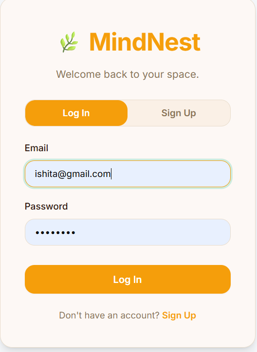
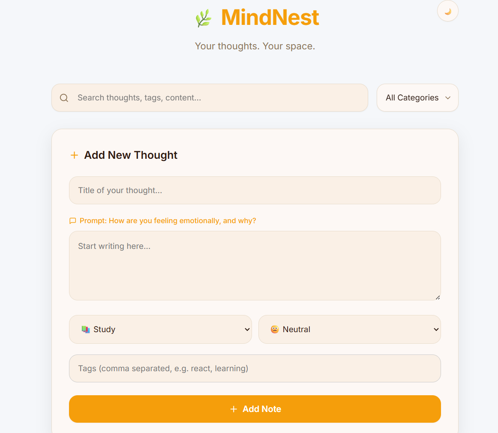
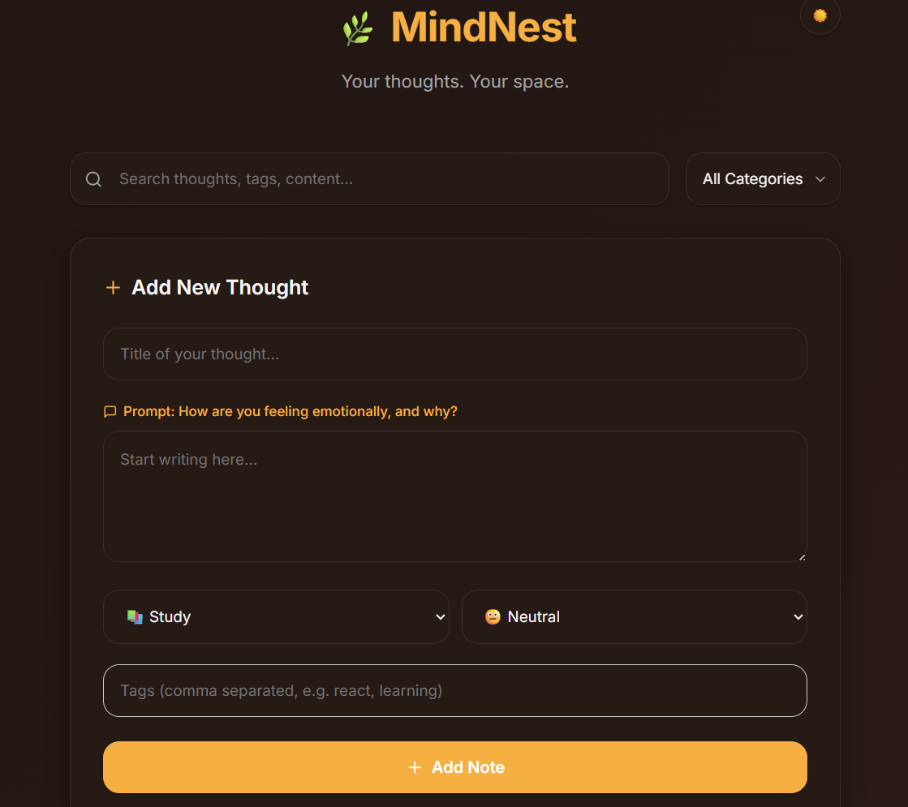

# 🌿 MindNest — Personal Knowledge & Reflection System

> MindNest is a full-stack MERN application designed to capture, organize, and retrieve personal knowledge and reflections efficiently. It combines fast note-taking with tag-based retrieval and emotional context tracking.


---

## 📖 About The Project

MindNest is a lightweight, full-stack personal knowledge management system built with the MERN stack. It solves a real problem — valuable ideas get forgotten, learning resources get scattered, and most note apps are too complex to use quickly.

MindNest focuses on **fast capture and smart retrieval**. No folders. No complex hierarchy. Just write, tag, and find.

## 📸 Screenshots

| Login | Light Mode | Dark Mode |
|:---:|:---:|:---:|
|  |  |  |
---

## ✨ Features

- 🔐 **JWT Authentication** — Secure login with hashed passwords and token-based session management.
- 📝 **Quick Note Capture** — Add a note with title, content, tags, category and emotion in seconds.
- 🗂️ **Tag-Based Organization** — Flexible tagging system with no rigid folder structure.
- 🔎 **Live Search** — Search across title, content and tags simultaneously in real time.
- 🏷️ **Category & Tag Filtering** — Filter by Study, Career, Personal or Ideas; click any tag pill to filter instantly.
- 😊 **Emotion Tracking** — Log how you felt when capturing a thought (Happy, Motivated, Neutral, Stressed).
- ✏️ **Full CRUD** — Create, read, update and delete notes with smooth interactions.
- 🌙 **Dark Mode** — Toggle between light and dark themes with persistent `localStorage` preference (`theme`).
- ⚡ **Offline Caching** — Notes load instantly from the `mindnest_notes` localStorage cache before the backend responds.
- 📱 **Responsive Design** — Fully optimized for mobile, tablet and desktop viewports.
- 📅 **Date Tracking** — Every note displays a human-readable creation date automatically parsed from MongoDB.

---
🚀 Key Highlights

- Full-stack MERN architecture
- JWT-based secure authentication
- Tag-based flexible data modeling using MongoDB
- Real-time search and filtering
- Offline-first experience with localStorage caching
---

## 🛠️ Tech Stack

### Frontend
| Technology | Purpose |
|------------|---------|
| React 18 | UI library |
| Vite | Build tool and dev server |
| React Router DOM | Client-side routing |
| Axios | HTTP requests to backend API |
| CSS Variables | Theming, dark mode, and responsive layouts |

### Backend
| Technology | Purpose |
|------------|---------|
| Node.js | Server runtime |
| Express.js | Web framework and API routing |
| MongoDB | NoSQL document database |
| Mongoose | MongoDB object modeling |
| JSON Web Token (JWT) | Stateless authentication |
| bcryptjs | Password hashing |
| dotenv | Environment variable management |
| CORS | Cross-origin request handling |

---

## 📁 Project Structure

```text
MindNest/
├── client/                   # React frontend (Vite)
│   ├── src/
│   │   ├── components/
│   │   │   └── NoteCard.jsx  # Reusable note card component
│   │   ├── pages/
│   │   │   ├── Login.jsx     # Login page with JWT auth
│   │   │   └── Dashboard.jsx # Main app dashboard
│   │   ├── App.jsx           # Route configuration
│   │   └── index.css         # Global styles + dark mode + responsive variables
│   └── package.json
│
├── server/                   # Node.js + Express backend
│   ├── models/
│   │   ├── User.js           # User schema (email, password)
│   │   └── Note.js           # Note schema (title, content, tags, etc.)
│   ├── routes/
│   │   ├── auth.js           # Register and login routes
│   │   └── notes.js          # CRUD routes for notes
│   ├── middleware/
│   │   └── auth.js           # JWT verification middleware
│   ├── index.js              # Express server entry point
│   └── package.json
│
└── .gitignore
```

---

## 🚀 Getting Started

### Prerequisites

Make sure you have these installed:
- [Node.js](https://nodejs.org/) (v18 or higher)
- [MongoDB](https://www.mongodb.com/) (local or Atlas)
- [Git](https://git-scm.com/)

### Installation

**1. Clone the repository**
```bash
git clone https://github.com/IshitaBanerjee05/MindNest.git
cd MindNest
```

**2. Set up the backend**
```bash
cd server
npm install
```

**3. Create environment variables**

Create a `.env` file inside the `server` folder:
```env
PORT=5000
MONGO_URI=mongodb://localhost:27017/mindnest
JWT_SECRET=your_secret_key_here
```

**4. Start the backend server**
```bash
node index.js
```

You should see:
```text
MongoDB connected!
Server running on port 5000
```

**5. Set up the frontend** (in a new terminal)
```bash
cd client
npm install
npm run dev
```

**6. Open the app**
```text
http://localhost:5173
```
> **Note for Production:** The frontend currently makes Axios requests directly to `http://localhost:5000`. When deploying, remember to replace these URLs automatically with your deployed backend API URL using environment variables.

---

## 🔑 API Endpoints

### Auth Routes
| Method | Endpoint | Description |
|--------|----------|-------------|
| POST | `/api/auth/register` | Create a new user account |
| POST | `/api/auth/login` | Login and receive JWT token |

### Note Routes (Protected — requires JWT)
| Method | Endpoint | Description |
|--------|----------|-------------|
| GET | `/api/notes` | Fetch all notes for logged-in user |
| POST | `/api/notes` | Create a new note |
| PUT | `/api/notes/:id` | Update an existing note |
| DELETE | `/api/notes/:id` | Delete a note |

All protected routes require this header:
```http
Authorization: Bearer <your_jwt_token>
```

---

## 🗄️ Database Schema

### User
```javascript
{
  email:    String, // required, unique
  password: String  // required, hashed with bcrypt
}
```

### Note
```javascript
{
  title:     String, // required
  content:   String, // required
  tags:      [String],
  category:  String, // Study | Career | Personal | Ideas
  emotion:   String, // Happy | Motivated | Neutral | Stressed
  userId:    ObjectId, // ref: User
  createdAt: Date, // auto-generated
  updatedAt: Date  // auto-generated
}
```

---

## 🔐 How Authentication Works

1. User logs in with email and password.
2. Server verifies password using `bcrypt.compare()`.
3. Server generates a JWT token signed with `JWT_SECRET`.
4. Token is stored securely in the browser's `localStorage`.
5. Every API request includes the token in the `Authorization` header.
6. Auth middleware on the server verifies the token before allowing access.
7. `userId` is extracted from the token to ensure users only access their own notes.

---

## ⚡ Challenges Faced

- Designing a flexible tag-based schema in MongoDB
- Managing JWT authentication securely across frontend and backend
- Implementing real-time search across multiple fields
- Handling state synchronization with localStorage caching
  
---

## 💼 Resume Description

> **MindNest — Personal Knowledge & Reflection System** | MERN Stack
>
> Developed a full-stack personal knowledge management application enabling rapid note capture and intelligent tag-based retrieval. Implemented JWT authentication with bcrypt password hashing, RESTful API design with Express.js, and MongoDB's flexible document model for dynamic tag and category queries. Features include real-time search, emotion tracking, dark mode with localStorage persistence, and offline caching for instant load performance.

---

## 🔮 Future Improvements

- AI-powered note suggestions
- Voice-to-text capture for faster note creation
- Collaborative note sharing between users
- Advanced analytics (weekly insights, mood trends)
  
---

## 👩‍💻 Author

**Ishita Banerjee**
- GitHub: [@IshitaBanerjee05](https://github.com/IshitaBanerjee05)

---

> *"Your thoughts deserve a home."* 🌿
